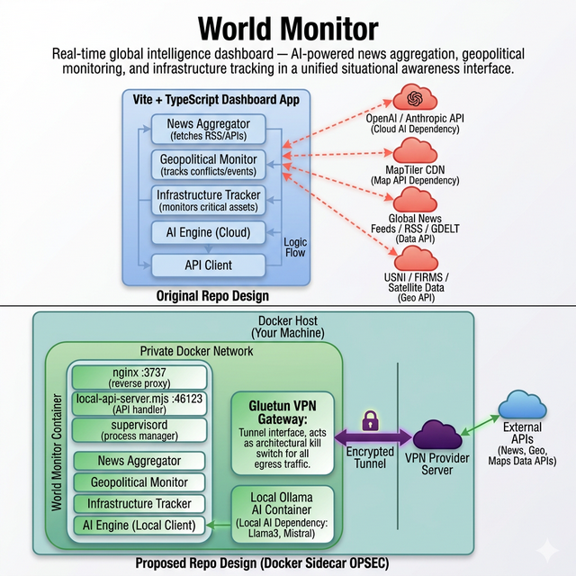

# Docker Self-Hosting Guide

Run World Monitor locally in Docker — no Vercel CLI, no cloud account needed.

## Quick Start

```bash
# Clone and enter the repo
git clone https://github.com/koala73/worldmonitor.git
cd worldmonitor

# Copy the example env file and edit as needed
cp .env.example .env.local

# Build and run (no VPN)
docker compose -f docker-compose.test.yml up -d --build

# Open the dashboard
open http://localhost:3740
```

## How It Works

### Architecture Comparison



The Dockerfile builds the Vite frontend (`tsc && vite build`) and pairs it
with nginx + the Tauri sidecar's `local-api-server.mjs` to serve the dashboard:

```
Browser :3740
    │
    └─ nginx
        ├── /        → static files (Vite build)
        └── /api/*   → local-api-server.mjs :46123
                          ├── 16 local handlers
                          └── cloud fallback → worldmonitor.app
```

Missing local API handlers automatically proxy to `worldmonitor.app`,
so the dashboard works immediately without configuring every API key.

## Full OSINT Stack (VPN + Local AI)

The main `docker-compose.yml` includes:
- **Gluetun** — VPN gateway with kill switch (ProtonVPN free tier)
- **Ollama** — local LLM inference (no data leaves your machine)

```bash
# 1. Get ProtonVPN OpenVPN credentials:
#    https://account.protonvpn.com/account#openvpn

# 2. Set credentials in .env.local:
VPN_USER=your_openvpn_username
VPN_PASS=your_openvpn_password

# 3. Start the full stack
docker compose up -d --build

# 4. Pull a model for local AI
docker exec ollama_ai ollama pull llama3
```

## Environment Variables

All API keys are optional. Unconfigured panels simply won't appear.

| Variable | Required | Notes |
|----------|----------|-------|
| `VPN_USER` / `VPN_PASS` | For VPN only | ProtonVPN OpenVPN creds |
| `OLLAMA_API_URL` | No | Default: `http://localhost:11434` |
| `OLLAMA_MODEL` | No | Default: `llama3` |
| `FINNHUB_API_KEY` | No | Free tier at finnhub.io |
| `FRED_API_KEY` | No | Free at api.stlouisfed.org |
| `EIA_API_KEY` | No | Free at api.eia.gov |
| `NASA_FIRMS_API_KEY` | No | Free at firms.modaps.eosdis.nasa.gov |
| `GROQ_API_KEY` | No | Free tier at groq.com |

## Commands Reference

```bash
# Test (no VPN)
docker compose -f docker-compose.test.yml up -d --build

# Full stack (VPN + AI)
docker compose up -d --build

# Watch logs
docker compose logs -f world_monitor

# Stop
docker compose down

# Rebuild after changes
docker compose build && docker compose up -d
```

## Ports

| Port | Service |
|------|---------|
| 3740 | Dashboard (nginx) |
| 46123 | API server (internal, proxied by nginx) |
| 11434 | Ollama API (optional) |

## Files

| File | Purpose |
|------|---------|
| `Dockerfile` | Multi-stage build: `npm ci` → `tsc` → `vite build` → nginx + supervisor |
| `docker-compose.yml` | Full stack: Gluetun VPN + World Monitor + Ollama |
| `docker-compose.test.yml` | Simple no-VPN testing |
| `nginx.conf` | Reverse proxy `/api/*` + SPA fallback |
| `supervisord.conf` | Process manager for nginx + api-server |
| `.dockerignore` | Build context optimization |
